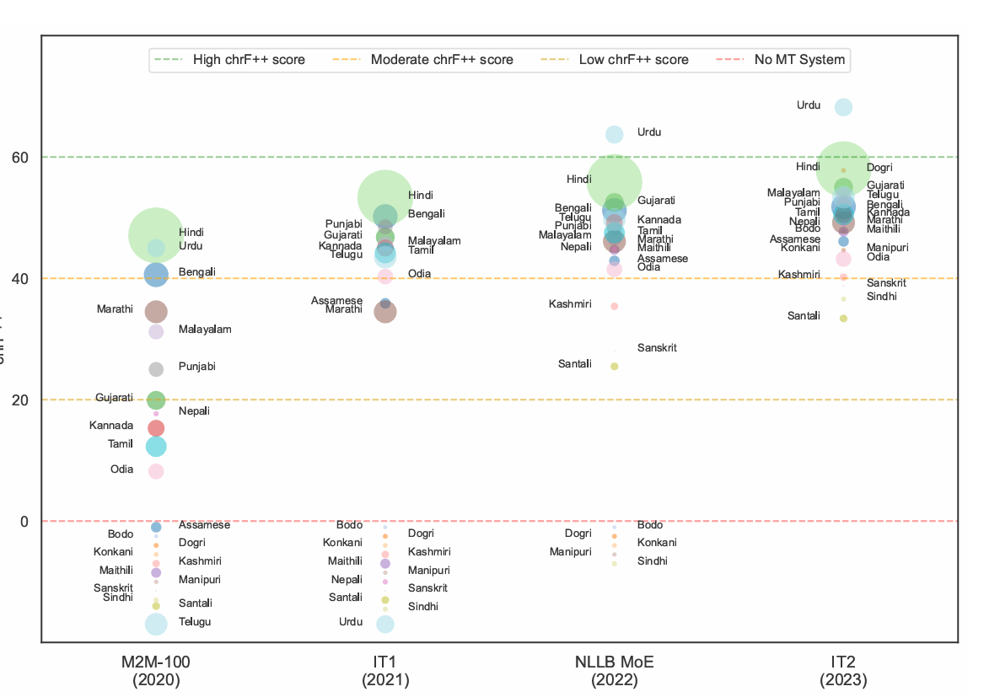
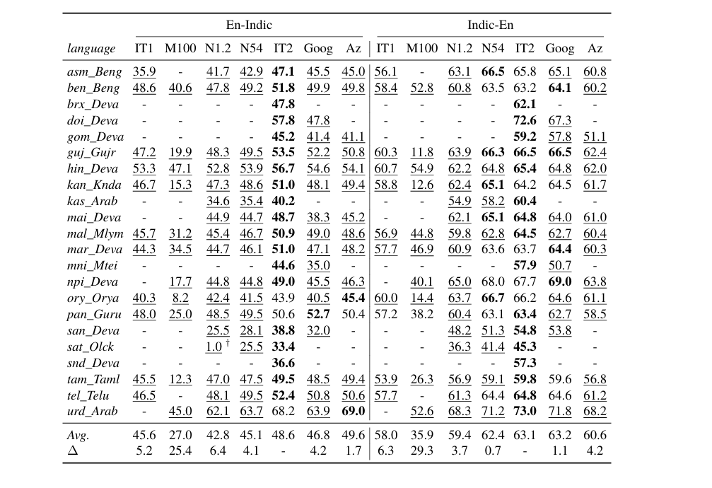

# language_translator

# Project Title
A brief description of what your project does and why it exists.

## Table of Contents
- [Installation](#installation)
- [Usage](#usage)
- [Features](#features)
- [Model Details](#model-details)
- [Evaluation Metrics](#evaluation-metrics)
- [References](#references)
- [Contributing](#contributing)
- [License](#license)

## Introduction
This project leverages IndicTrans2 200M parameter model (suitable for laptop GPU runs), a state-of-the-art multilingual neural machine translation (NMT) model developed by AI4Bharat, to enable high-quality translation across all 22 scheduled Indian languages. Built on transformer architecture, IndicTrans2 supports translation between English↔Indic and Indic↔Indic language pairs, including multiple scripts for low-resource languages such as Kashmiri, Manipuri, and Sindhi.
The model is trained on the Bharat Parallel Corpus Collection (BPCC), comprising over 230 million bitext pairs, and evaluated on diverse benchmarks like IN22-Gen and IN22-Conv, covering general and conversational domains. It incorporates script unification and lexical sharing to improve performance across morphologically rich and low-resource languages.
IndicTrans2 is open-source, Hugging Face-compatible, and optimized for both research and production-grade deployment.

## Installation
Step-by-step instructions to set up the project locally.
https://github.com/AI4Bharat/IndicTrans2/tree/main?tab=readme-ov-file#installation

### Clone the github repository and navigate to the project directory.
git clone https://github.com/AI4Bharat/IndicTrans2
cd IndicTrans2

### Install all the dependencies and requirements associated with the project.
source install.sh


## Usage
Sample code to invoke the Model for language translation
<pre>python
import torch
from transformers import AutoModelForSeq2SeqLM, AutoTokenizer
import sys

#Add the path to the cloned repository's huggingface_interface directory
sys.path.append("IndicTrans2/huggingface_interface")
sys.path.append("IndicTransToolkit")

from IndicTransToolkit.processor import IndicProcessor

#### recommended to run this on a gpu with flash_attn installed
#### don't set attn_implemetation if you don't have flash_attn
DEVICE = "cuda" if torch.cuda.is_available() else "cpu"
print(DEVICE)

src_lang, tgt_lang = "eng_Latn", "hin_Deva"
model_name = "ai4bharat/indictrans2-en-indic-dist-200M"
tokenizer = AutoTokenizer.from_pretrained(model_name, trust_remote_code=True)

model = AutoModelForSeq2SeqLM.from_pretrained(
    model_name,
    trust_remote_code=True,
    torch_dtype=torch.float16, # performance might slightly vary for bfloat16
    attn_implementation="flash_attention_2"
).to(DEVICE)

ip = IndicProcessor(inference=True)

input_sentences = [
    "When I was young, I used to go to the park every day.",
    "We watched a new movie last week, which was very inspiring.",
    "If you had met me at that time, we would have gone out to eat.",
    "My friend has invited me to his birthday party, and I will give him a gift.",
]

batch = ip.preprocess_batch(input_sentences, src_lang=src_lang, tgt_lang=tgt_lang)

#### Tokenize the sentences and generate input encodings
inputs = tokenizer(
    batch,
    truncation=True,
    padding="longest",
    return_tensors="pt",
    return_attention_mask=True,
).to(DEVICE)

#### Generate translations using the model
with torch.no_grad():
    generated_tokens = model.generate(
        **inputs,
        use_cache=True,
        min_length=0,
        max_length=256,
        num_beams=5,
        num_return_sequences=1,
    )


#### Decode the generated tokens into text
generated_tokens = tokenizer.batch_decode(
    generated_tokens,
    skip_special_tokens=True,
    clean_up_tokenization_spaces=True,
)

#### Postprocess the translations, including entity replacement
translations = ip.postprocess_batch(generated_tokens, lang=tgt_lang)

for input_sentence, translation in zip(input_sentences, translations):
    print(f"{src_lang}: {input_sentence}")
    print(f"{tgt_lang}: {translation}")
</pre>

## Features
Highlight key capabilities or unique aspects of the project.

## Model Details
Architecture, training data, supported languages, and benchmarks.

We are using the AI4Bharat IndicTrans2 200M Model Github link https://github.com/AI4Bharat/IndicTrans2

IndicTrans2 is an open-source, transformer-based multilingual neural machine translation (NMT) model developed by AI4Bharat. 
It supports high-quality translation across all 22 scheduled Indian languages, including multiple scripts for low-resource languages like Kashmiri, Manipuri, and Sindhi.

Key features:
- Multilingual support: En→Indic, Indic→En, and Indic↔Indic translation.
- Script unification: Enables transfer learning via lexical sharing across five major scripts—Devanagari, Latin, Perso-Arabic, Ol Chiki, and Meitei.
- Training data: Built on the Bharat Parallel Corpus Collection (BPCC) with over 230M bitext pairs, including human-annotated and backtranslated data.
- Benchmarks: Evaluated on IN22-Gen and IN22-Conv, covering general and conversational domains.
- Deployment-ready: Hugging Face-compatible models and inference scripts available.

The model is a significant step toward democratizing access to high-quality translation tools for Indian languages.

# Model Architecture
<pre>
IndicTransForConditionalGeneration(
  (model): IndicTransModel(
    (encoder): IndicTransEncoder(
      (embed_tokens): Embedding(32322, 512, padding_idx=1)
      (embed_positions): IndicTransSinusoidalPositionalEmbedding()
      (layers): ModuleList(
        (0-17): 18 x IndicTransEncoderLayer(
          (self_attn): IndicTransAttention(
            (k_proj): Linear(in_features=512, out_features=512, bias=True)
            (v_proj): Linear(in_features=512, out_features=512, bias=True)
            (q_proj): Linear(in_features=512, out_features=512, bias=True)
            (out_proj): Linear(in_features=512, out_features=512, bias=True)
          )
          (self_attn_layer_norm): LayerNorm((512,), eps=1e-05, elementwise_affine=True)
          (activation_fn): GELUActivation()
          (fc1): Linear(in_features=512, out_features=2048, bias=True)
          (fc2): Linear(in_features=2048, out_features=512, bias=True)
          (final_layer_norm): LayerNorm((512,), eps=1e-05, elementwise_affine=True)
        )
      )
      (layer_norm): LayerNorm((512,), eps=1e-05, elementwise_affine=True)
      (layernorm_embedding): LayerNorm((512,), eps=1e-05, elementwise_affine=True)
    )
    (decoder): IndicTransDecoder(
      (embed_tokens): Embedding(122672, 512, padding_idx=1)
      (embed_positions): IndicTransSinusoidalPositionalEmbedding()
      (layers): ModuleList(
        (0-17): 18 x IndicTransDecoderLayer(
          (self_attn): IndicTransAttention(
            (k_proj): Linear(in_features=512, out_features=512, bias=True)
            (v_proj): Linear(in_features=512, out_features=512, bias=True)
            (q_proj): Linear(in_features=512, out_features=512, bias=True)
            (out_proj): Linear(in_features=512, out_features=512, bias=True)
          )
          (activation_fn): GELUActivation()
          (self_attn_layer_norm): LayerNorm((512,), eps=1e-05, elementwise_affine=True)
          (encoder_attn): IndicTransAttention(
            (k_proj): Linear(in_features=512, out_features=512, bias=True)
            (v_proj): Linear(in_features=512, out_features=512, bias=True)
            (q_proj): Linear(in_features=512, out_features=512, bias=True)
            (out_proj): Linear(in_features=512, out_features=512, bias=True)
          )
          (encoder_attn_layer_norm): LayerNorm((512,), eps=1e-05, elementwise_affine=True)
          (fc1): Linear(in_features=512, out_features=2048, bias=True)
          (fc2): Linear(in_features=2048, out_features=512, bias=True)
          (final_layer_norm): LayerNorm((512,), eps=1e-05, elementwise_affine=True)
        )
      )
      (layer_norm): LayerNorm((512,), eps=1e-05, elementwise_affine=True)
      (layernorm_embedding): LayerNorm((512,), eps=1e-05, elementwise_affine=True)
    )
  )
  (lm_head): Linear(in_features=512, out_features=122672, bias=False)
)
</pre>

The `IndicTransForConditionalGeneration` model is built upon the `IndicTransModel` and includes an additional `lm_head` for language modeling

**Overall Architecture:**

* **`model` (IndicTransModel):** This is the core Transformer-based model, comprising an encoder and a decoder.
    * **`encoder` (IndicTransEncoder):**
        * **`embed_tokens`:** An embedding layer with a vocabulary size of 32,322 and an embedding dimension of 512, used to convert input tokens into dense vector representations.
        * **`embed_positions`:** `IndicTransSinusoidalPositionalEmbedding` for incorporating positional information into the embeddings.
        * **`layers`:** 18 `IndicTransEncoderLayer` modules. Each layer consists of:
            * **`self_attn`:** A multi-head self-attention mechanism (`IndicTransAttention`) with input/output features of 512.
            * **`self_attn_layer_norm`:** Layer normalization after self-attention.
            * **`activation_fn`:** GELU activation function.
            * **`fc1`, `fc2`:** A two-layer feed-forward network with an inner dimension of 2048 and input/output dimensions of 512.
            * **`final_layer_norm`:** Layer normalization after the feed-forward network.
        * **`layer_norm`, `layernorm_embedding`:** Additional layer normalization components.
    * **`decoder` (IndicTransDecoder):**
        * **`embed_tokens`:** An embedding layer with a larger vocabulary size of 122,672 and an embedding dimension of 512, suggesting a richer target language vocabulary.
        * **`embed_positions`:** `IndicTransSinusoidalPositionalEmbedding` for positional encoding.
        * **`layers`:** 18 `IndicTransDecoderLayer` modules. Each layer includes:
            * **`self_attn`:** Self-attention mechanism.
            * **`activation_fn`:** GELU activation.
            * **`self_attn_layer_norm`:** Layer normalization after self-attention.
            * **`encoder_attn`:** Encoder-decoder attention mechanism to attend over the encoder's output.
            * **`encoder_attn_layer_norm`:** Layer normalization after encoder-decoder attention.
            * **`fc1`, `fc2`:** A two-layer feed-forward network.
            * **`final_layer_norm`:** Layer normalization after the feed-forward network.
        * **`layer_norm`, `layernorm_embedding`:** Additional layer normalization components.

* **`lm_head` (Linear):** A linear layer that projects the decoder's output features (512) to the size of the target vocabulary (122,672), used for predicting the next token in sequence generation tasks.

**Key Features and Design Choices:**

* **Encoder-Decoder Transformer:** Follows the standard Transformer architecture, which is highly effective for sequence-to-sequence tasks.
* **Deep Stacking:** Both the encoder and decoder have 18 layers, indicating a deep model capable of learning complex representations.
* **Attention Mechanisms:** Utilizes self-attention in both encoder and decoder, and cross-attention (encoder-decoder attention) in the decoder for context integration.
* **Sinusoidal Positional Embeddings:** Employs `IndicTransSinusoidalPositionalEmbedding`, a common choice for capturing sequence order without learning additional parameters.
* **GELU Activation:** Uses GELU (Gaussian Error Linear Unit) as the activation function within the feed-forward networks.
* **Layer Normalization:** Extensively uses layer normalization throughout the model, contributing to training stability and performance.
* **Embedding Dimensions:** Consistent embedding and hidden dimensions of 512 across the model.
* **Vocabulary Sizes:** Different vocabulary sizes for encoder (32,322) and decoder (122,672) suggest that the model is designed to handle potentially different token sets for source and target languages, which is typical for machine translation of Indic languages where target languages might have a larger effective vocabulary or character set.

This architecture is characteristic of a robust neural machine translation model designed for handling languages, likely including a significant focus on Indic languages given the "IndicTrans" naming convention.

## Evaluation Metrics

## A visual representation of machine translation systems for Indic languages using the IN22-Gen Evaluation set in the En-Indic direction

 Source - https://arxiv.org/pdf/2305.16307



## chrF++ Scores comparison of IndicTrans2 with different models 
```
Reference - https://arxiv.org/pdf/2305.16307
 M100 - M2M-100 model
 N1.2 - NLLB 1.2B distilled model as 
 N54 - NLLB 54.5B MoE model 
 Goog - Google Translate 
 Az - Microsoft Azure Translate 
 IT2 - IndicTrans2 model
 ```



## Excercise 
Aim - Understand the dataset preparation for language translation and chrF++ scoring comparison against different language translation models

Steps performed
1. Created Agriculture and plant disease data set from text books and websites - PDF stored under "raw data source"
2. Use description on "Potato" plant in English from the Book
3. Use description on "Potato" plant in Kannada from the Book
4. Provide the text to Google translation API and cacluate Metrics (use compute_metrics.sh from Indic site)
5. Use IndicTrans2 API to perform Language translation and cacluate Metrics (use compute_metrics.sh from Indic site)
6. Compare the scores

Google Translator chrF2 score - 49.6, chrF2++ 45.8
IndicTrans2 Translator chrF2 score - 45.6, chrF2++ 40.9

The scores for English to Kannada as compared with the references is around the same
Here we have choosen the IndicTrans2 200M parameter model running on Single laptop NVIDIA GPU

## Human Eval
English to Hindi, Kannada, Tamil text generated for the Agriculture model are Human evaled and found to be correct using the IndicTrans2 200M parameter model.

## How is chrF++ calculated
chrF++ is a machine translation evaluation metric that calculates the similarity between a machine translation output (hypothesis) and one or more human reference translations. It's an extension of the original chrF metric.

Here's a breakdown of how chrF++ is calculated:

**1. Core Idea: F-score based on N-grams**

Both chrF and chrF++ are built upon the F-score statistic, which is the harmonic mean of precision and recall.

The general formula for an n-gram based F-score is:

$F_{\beta} = \frac{(1 + \beta^2) \cdot Precision \cdot Recall}{\beta^2 \cdot Precision + Recall}$

Where:
* **Precision (P)**: The percentage of n-grams in the hypothesis that are also found in the reference(s).
* **Recall (R)**: The percentage of n-grams in the reference(s) that are also found in the hypothesis.
* **$\beta$ (beta)**: A parameter that determines the importance of recall with respect to precision. For chrF and chrF++, $\beta = 2$ is typically used, meaning recall is weighted twice as much as precision. This emphasizes that a good translation should cover most of the information in the reference.

**2. Character N-grams (chrF foundation):**

The original chrF metric focuses on **character n-grams**. This means it looks at sequences of characters (e.g., "the" has character unigrams 't', 'h', 'e'; bigrams 'th', 'he'; trigrams 'the').

* It calculates character n-gram precision and recall for various n-gram lengths (typically up to 6 for character n-grams, i.e., $N=1$ to $6$).
* These precision and recall values are then averaged over all character n-gram lengths to get overall character n-gram precision ($CHRP$) and recall ($CHRR$).
* Finally, the $F_{\beta}$ score (with $\beta=2$) is calculated using $CHRP$ and $CHRR$.

**3. Adding Word N-grams for chrF++:**

chrF++ enhances chrF by incorporating **word n-grams** in addition to character n-grams. This addition was found to improve correlation with human judgments of translation quality.

* Typically, chrF++ includes **word unigrams (1-grams) and bigrams (2-grams)**.
* It calculates word n-gram precision and recall similarly to character n-grams.
* The scores from character n-grams and word n-grams are then *averaged together* to produce the final chrF++ score. The default character n-gram order is 6, and the default word n-gram order is 2.


## Translation Performance

Time taken for Eng to Indic Languages for small text with GPU less than 1 seconds
Time taken for Eng to Indic Languages for medium text with GPU around 1.4 seconds

## References
1. IndicTrans2: Towards High-Quality and Accessible Machine Translation Models for all 22 Scheduled Indian Languages https://arxiv.org/pdf/2305.16307 
2. Class 6 Science Text Book English - file:///C:/Users/Prasad/Downloads/6th-english-science.pdf
3. Class 6 Science Text Book Kannada - file:///C:/Users/Prasad/Downloads/6th-kannada-science.pdf
4. https://agriculture.vikaspedia.in/viewcontent/agriculture/crop-production/integrated-weed-management/biological-control-of-parthenium?lgn=en#section2

## Contributing
Guidelines for submitting issues or pull requests.

## License
Specify the license (e.g., MIT, Apache 2.0) and usage terms.


